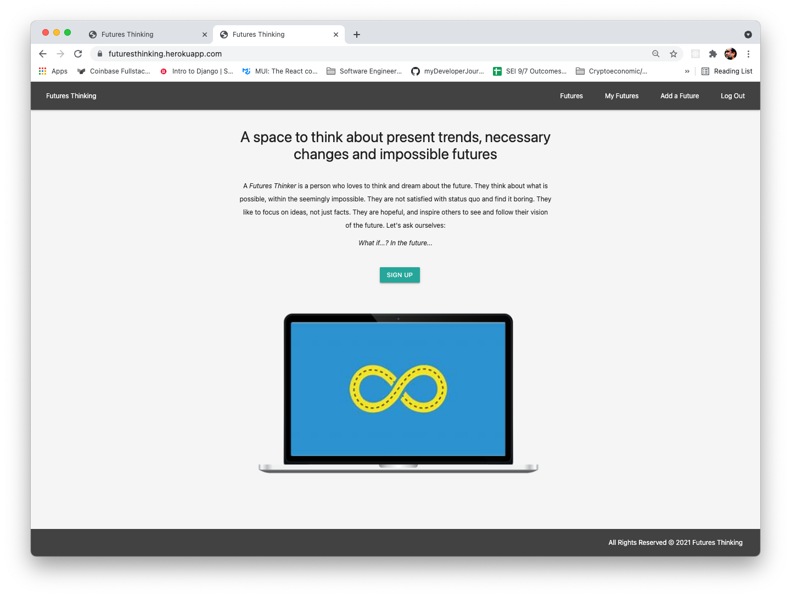
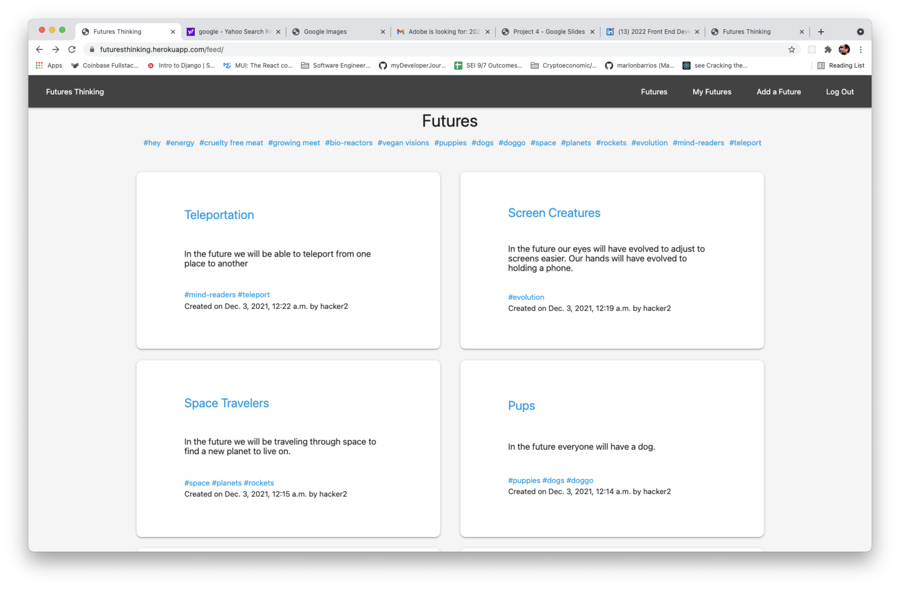
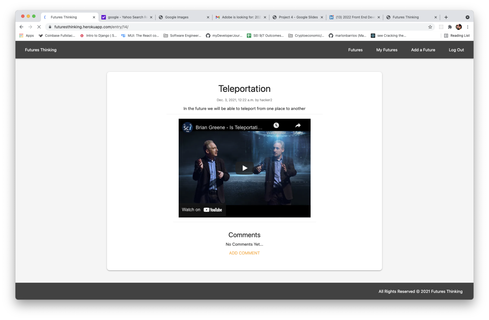
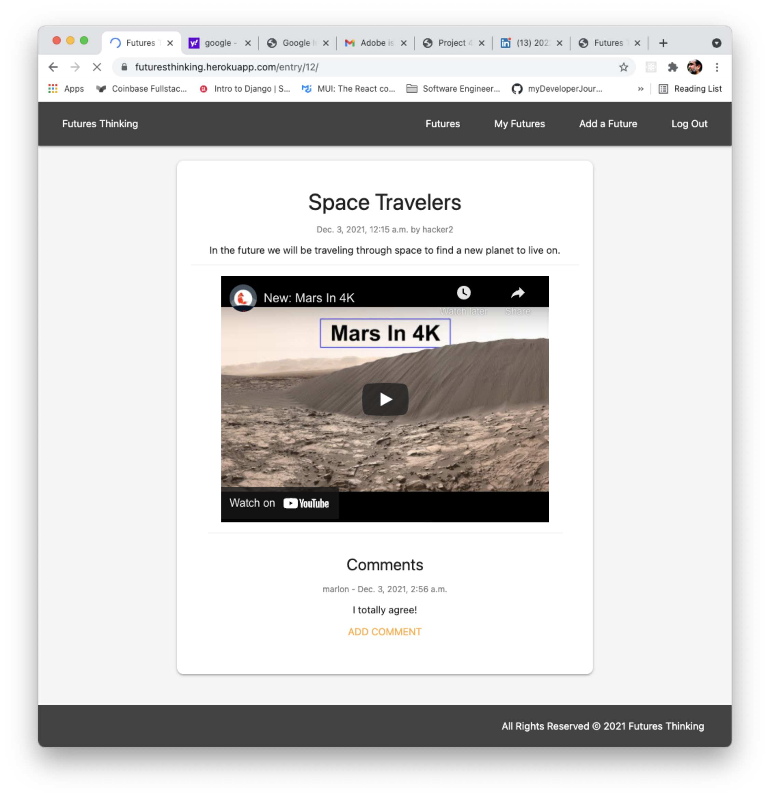
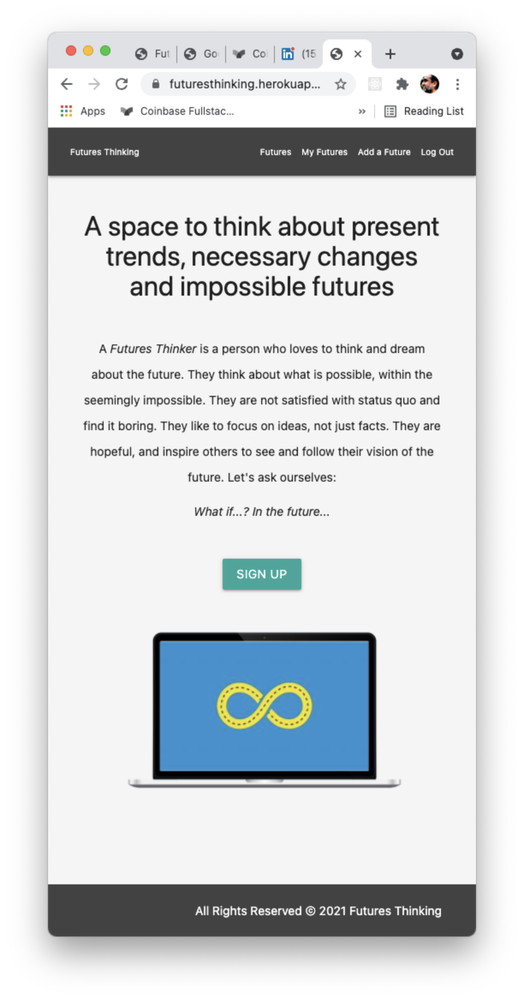
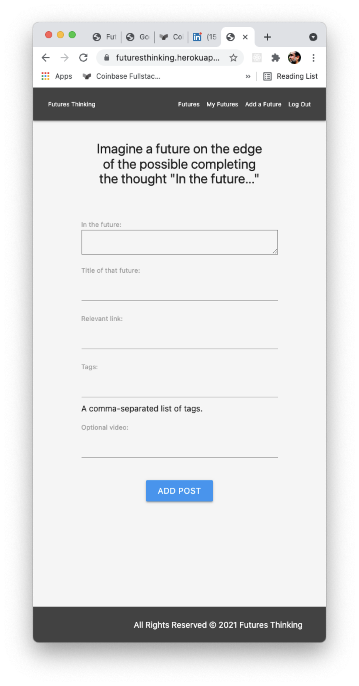

## Futures Thinking
In the last years , humanity is facing unprecedented global challenges and lots of unknowns-for which current and aspiring leaders are requiring special cognitive and knowledge tools to increase their sensibility to systemic trends, changes and be able to creatively influence the future. 

We need tools to envision and making the improbable, possible. We have developed this app as an instigation tool to think and envision futures and increase the possibilities of innovation and responsible progress. 

We were inspired by the Futures Thinking discipline, as an approach to creative and exploratory process that uses divergent thinking, seeking many possible answers and acknowledging uncertainty. It's a different mind-set to analytical thinking which uses convergent thinking to seek the right answer and reduce uncertainty. In Futures Thinking, the user is prompted to complete the phrase: "In the future...". 

After authentication, the user can  create, read a stream of ideas of all users and its own. The users can leave comments in each others 'Futures'. The entries are sorted by user generated tags and they can also add a titles, videos and links. The user can edit and delete their entries.

### Technologies Used

* HTML5
* CSS3
* JavaScript
* Python
* Django
* PostgreSQL
* Materialize
* Heroku

### Screenshots

### Links

* [www.futures-thinking.io](https://futuresthinking.herokuapp.com/)

### Getting Started

* 
* Create an account (signup and login)
* Access to all entries and each other's entries.
* Create, update and delete its own entries
* User generated tagging and soting of entries.
* Media embedding with link: YouTube, Vimeo and SoundCloud.
* Commenting on each others entries.

### Future Improvements:

* Email suscription to automated selection of Futures.
* User profiles with Bios, Linkedin and profile image.
* User can delete and update comments.
* Social Media sharing buttons.

### Development Team:

Marlon Barrios Solano

https://github.com/marlonbarrios

Raimundo Llao

https://github.com/rallao

Tyler Rice

https://github.com/tylerrice121

 
